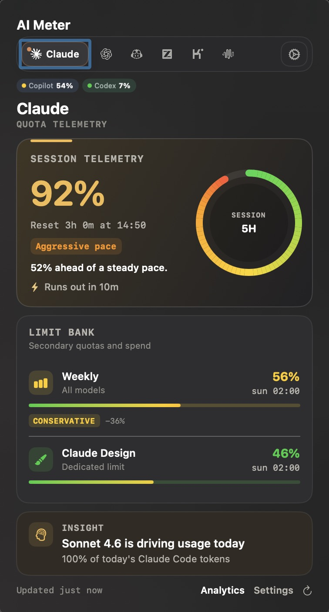
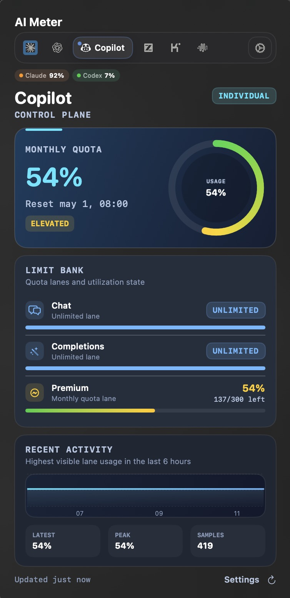
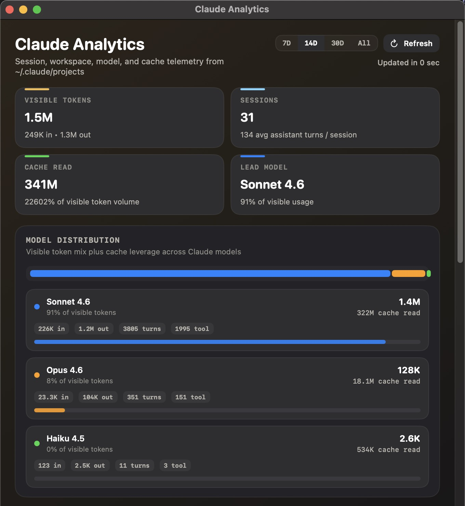
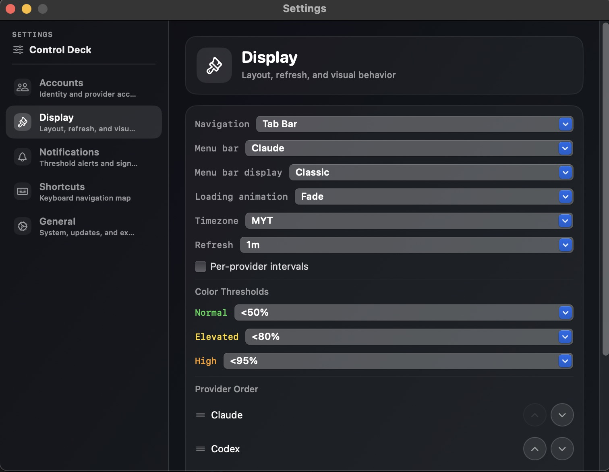
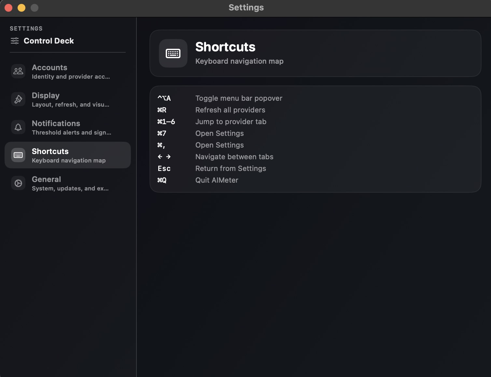

# AIMeter

A native macOS menu bar app for monitoring multi-provider LLM usage and quotas — Claude, ChatGPT, GitHub Copilot, GLM, Kimi, and MiniMax.

---

## Overview

AIMeter sits in your menu bar and surfaces your AI provider usage at a glance — session windows, weekly quotas, model-specific limits, and extra credits. It reads existing authentication from the macOS Keychain, so there is no separate login required for providers you already use.

---

## Features

- Menu bar icon with a color-coded gauge reflecting your highest active utilization
- Popover with per-limit progress bars, reset times, and credit balances across all providers
- Automatic polling with a configurable refresh interval (30s, 60s, 120s)
- Color thresholds: green below 50%, yellow 50-79%, red 80% and above
- Reset times displayed in your configured timezone
- Per-folder Claude account routing — map filesystem paths to specific Claude profiles
- Active Sessions dashboard showing every running `claude` CLI session with profile, project, and live duration
- RTK token compression tracking — see how much output you're saving on long conversations
- No Dock icon — runs as a background agent
- Auto-updates via [Sparkle](https://sparkle-project.org)

---

## Screenshots

### Quota Popover

| Claude | Copilot |
|:---:|:---:|
|  |  |
| Session telemetry, limit bank, pace tracking, and model insight | Monthly quota, lane breakdown, and recent activity chart |

### Analytics Window

Deep-dive into session history — visible tokens, cache leverage, model distribution, and daily traffic trends across your Claude Code sessions.

### Settings

| Display | Keyboard Shortcuts |
|:---:|:---:|
|  |  |
| Navigation style, refresh interval, timezone, color thresholds, and provider order | Full keyboard navigation map for power users |

---

## Requirements

- macOS 14.0 (Sonoma) or later
- Apple silicon or Intel
- For Claude usage tracking: Claude Code installed and authenticated

---

## Install

1. Download the latest `AIMeter-vX.Y.Z.zip` from the [Releases](https://github.com/Khairul989/ai-meter-releases/releases) tab.
2. Unzip and move `AIMeter.app` to `/Applications`.
3. **First launch only:** right-click the app and choose **Open** (bypasses Gatekeeper for unsigned apps).
4. AIMeter appears in your menu bar.

---

## Updates

AIMeter checks for updates automatically via Sparkle. New releases appear in-app — no manual download needed after first install. You can also check manually via the menu bar popover → settings → "Check for Updates..."

---

## License

[MIT License](LICENSE) — Copyright (c) 2026 Khairul.
